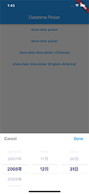
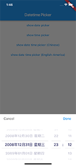
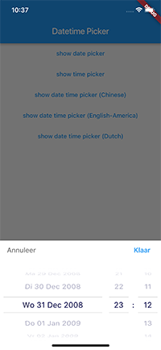
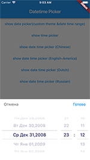
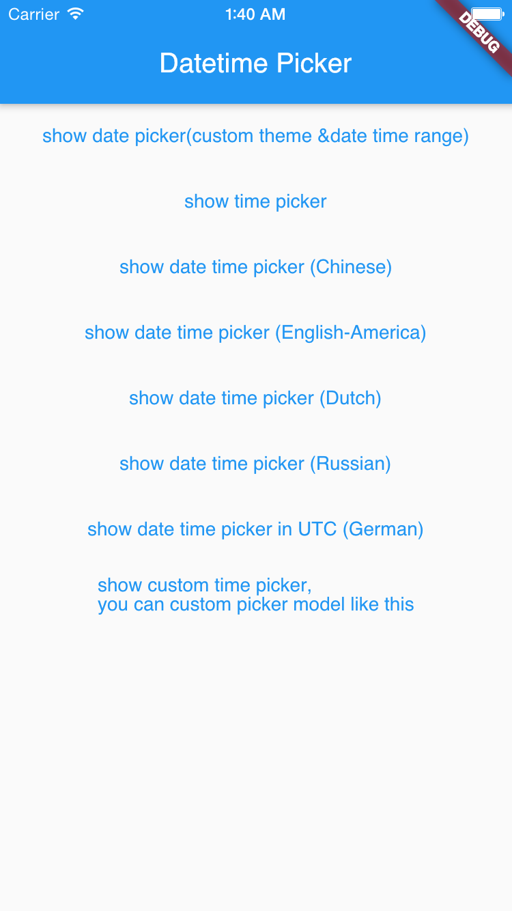

# Flutter Datetime Picker

[(Pub) flutter_datetime_picker](https://pub.dev/packages/flutter_datetime_picker)

A flutter date time picker inspired by [flutter-cupertino-date-picker](https://github.com/wuzhendev/flutter-cupertino-date-picker)

you can choose date / time / date&time in multiple languages:

- Albanian(sq)
- Arabic(ar)
- Armenian(hy)
- Azerbaijan(az)
- Basque(eu)
- Bengali(bn)
- Bulgarian(bg)
- Catalan(cat)
- Chinese(zh)
- Danish(da)
- Dutch(nl)
- English(en)
- French(fr)
- German(de)
- Hebrew(he)
- Indonesian(id)
- Italian(it)
- Japanese(jp)
- Kazakh(kk)
- Korean(ko)
- Persian(fa)
- Polish (pl)
- Portuguese(pt)
- Russian(ru)
- Spanish(es)
- Swedish(sv)
- Thai(th)
- Turkish(tr)
- Vietnamese(vi)
- Khmer(kh)


and you can also custom your own picker content

| Date picker          | Time picker          | Date Time picker                 |
| -------------------- | -------------------- | -------------------------------- |
|  |  |  |

International:

| Date Time picker (Chinese)       | Date Time picker (America)       | Date Time picker (Dutch)       | Date Time picker (Russian)       |
| -------------------------------- | -------------------------------- | ------------------------------ | -------------------------------- |
|  |  |  |  |


## Demo App



## Usage

```
TextButton(
    onPressed: () {
        DatePicker.showDatePicker(context,
                              showTitleActions: true,
                              minTime: DateTime(2018, 3, 5),
                              maxTime: DateTime(2019, 6, 7), onChanged: (date) {
                            print('change $date');
                          }, onConfirm: (date) {
                            print('confirm $date');
                          }, currentTime: DateTime.now(), locale: LocaleType.zh);
    },
    child: Text(
        'show date time picker (Chinese)',
        style: TextStyle(color: Colors.blue),
    ));
```

## Customize

If you want to customize your own style of date time picker, there is a class called CommonPickerModel, every type of date time picker is extended from this class, you can refer to other picker model (eg. DatePickerModel), and write your custom one, then pass this model to showPicker method, so that your own date time picker will appear, it’s easy, and will perfectly meet your demand

How to customize your own picker model:

```
class CustomPicker extends CommonPickerModel {
  String digits(int value, int length) {
    return '$value'.padLeft(length, "0");
  }

  CustomPicker({DateTime currentTime, LocaleType locale}) : super(locale: locale) {
    this.currentTime = currentTime ?? DateTime.now();
    this.setLeftIndex(this.currentTime.hour);
    this.setMiddleIndex(this.currentTime.minute);
    this.setRightIndex(this.currentTime.second);
  }

  @override
  String leftStringAtIndex(int index) {
    if (index >= 0 && index < 24) {
      return this.digits(index, 2);
    } else {
      return null;
    }
  }

  @override
  String middleStringAtIndex(int index) {
    if (index >= 0 && index < 60) {
      return this.digits(index, 2);
    } else {
      return null;
    }
  }

  @override
  String rightStringAtIndex(int index) {
    if (index >= 0 && index < 60) {
      return this.digits(index, 2);
    } else {
      return null;
    }
  }

  @override
  String leftDivider() {
    return "|";
  }

  @override
  String rightDivider() {
    return "|";
  }

  @override
  List<int> layoutProportions() {
    return [1, 2, 1];
  }

  @override
  DateTime finalTime() {
    return currentTime.isUtc
        ? DateTime.utc(currentTime.year, currentTime.month, currentTime.day,
            this.currentLeftIndex(), this.currentMiddleIndex(), this.currentRightIndex())
        : DateTime(currentTime.year, currentTime.month, currentTime.day, this.currentLeftIndex(),
            this.currentMiddleIndex(), this.currentRightIndex());
  }
}
```


## Getting Started

For help getting started with Flutter, view our online [documentation](https://flutter.io/).

For help on editing package code, view the [documentation](https://flutter.io/developing-packages/).
